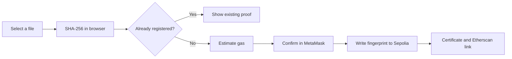
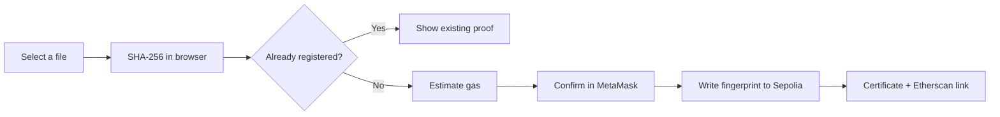

<div align="center">

# Proof of Existence

### A private document fingerprint, notarized on Ethereum.

Hash a file in your browser, anchor its fingerprint on-chain, and verify the original later without uploading the document itself.


</div>

## Why it exists

Important files often need a trustworthy timestamp: a draft, design, research note, contract, or other digital artifact. **Proof of Existence** creates that timestamp without sending the file to a server.

The app computes a SHA-256 fingerprint locally, stores only that fingerprint and its registration metadata on the Ethereum Sepolia testnet, and later compares a file against the permanent record.

> The blockchain sees the fingerprint, not the document.

## What you can do

- **Register a document** - drop in a file, review its hash and estimated gas, then confirm the transaction in MetaMask.
- **Verify a document** - select a file to check whether its exact bytes match an on-chain registration.
- **Review your history** - browse registrations made by the connected wallet and open each transaction in Etherscan.
- **Generate a certificate** - after confirmation, view the registration details and keep a shareable proof of the transaction.
- **Stay in control of the file** - hashing happens in the browser; the document itself is never sent to the app or contract.

## How it works



Verification follows the same first step: hash the selected file locally, call `verifyDoc` on the contract, and report whether an exact match exists. A one-byte change produces a different fingerprint.

## Quick start

### Prerequisites

- Node.js 18 or newer
- npm
- [MetaMask](https://metamask.io/) installed in your browser
- Sepolia ETH for registration transactions

### Run locally

```bash
git clone <your-repository-url>
cd proof-of-existence
npm install
npm run dev
```

Open the local URL printed by Vite, connect MetaMask, and switch to **Ethereum Sepolia** when prompted by the app.

### Production build

```bash
npm run build
npm run preview
```

## Smart contract

The frontend is currently configured for this deployed contract on Ethereum Sepolia:

| Detail    | Value                                                                                                                           |
| --------- | ------------------------------------------------------------------------------------------------------------------------------- |
| Network   | Ethereum Sepolia                                                                                                                |
| Chain ID  | `11155111` (`0xaa36a7`)                                                                                                         |
| Contract  | [`0x34717597F69CEe6C09279cCd9c7339710e6e877B`](https://sepolia.etherscan.io/address/0x34717597F69CEe6C09279cCd9c7339710e6e877B) |
| Etherscan | [View contract](https://sepolia.etherscan.io/address/0x34717597F69CEe6C09279cCd9c7339710e6e877B)                                |

The contract interface used by the app exposes:

```solidity
function registerDoc(string calldata docHash) external;
function verifyDoc(string calldata docHash)
	external
	view
	returns (uint256 timestamp, address registrant);
```

The frontend reads registration events from the configured deployment block to populate wallet history.

## Privacy and trust model

### What stays local

- The selected file contents
- The browser-side SHA-256 operation
- The original document itself

### What becomes public

- The SHA-256 fingerprint
- The registration timestamp
- The registering wallet address
- The transaction data and history on Sepolia

Anyone with the same file can calculate the same fingerprint. Do not register a document if revealing its fingerprint could expose sensitive information, and remember that Sepolia is a public test network rather than a production archive.

## Tech stack

- [React 19](https://react.dev/) for the interface
- [Vite](https://vite.dev/) for development and builds
- [Ethers v6](https://docs.ethers.org/v6/) for wallet and contract access
- [Tailwind CSS](https://tailwindcss.com/) for styling
- [Lucide React](https://lucide.dev/) for interface icons
- [jsPDF](https://github.com/parallax/jsPDF) and [qrcode](https://github.com/soldair/node-qrcode) for certificates
- Native Web Crypto API for SHA-256 hashing

## Project structure

```text
src/
├── components/       UI tabs, wallet header, history, certificate modal
├── constants/        Contract ABI, address, network, deployment block
├── hooks/            Wallet and contract access helpers
├── utils/            File hashing, error messages, certificate generation
├── App.jsx           Main application flow
├── App.css           Component-level styles
└── index.css         Tailwind theme and global styles
```

## Available scripts

| Command           | Purpose                              |
| ----------------- | ------------------------------------ |
| `npm run dev`     | Start the Vite development server    |
| `npm run build`   | Create a production build            |
| `npm run preview` | Preview the production build locally |
| `npm run lint`    | Run ESLint across the project        |

## Notes for contributors

The contract address, ABI, Sepolia chain ID, and deployment block live in [`src/constants/contract.js`](src/constants/contract.js). If you point the UI at a different deployment, update those values together so reads, writes, and event history remain aligned.

Before opening a pull request:

```bash
npm run lint
npm run build
```

<div align="center">

Built for documents that deserve a timestamp.

</div>
<div align="center">

# Proof of Existence

### A private document fingerprint, notarized on Ethereum.

Hash a file in your browser, anchor its fingerprint on-chain, and verify the original later without uploading the document itself.

<br />


</div>

## Why it exists

Important files often need a trustworthy timestamp: a draft, design, research note, contract, or other digital artifact. **Proof of Existence** creates that timestamp without sending the file to a server.

The app computes a SHA-256 fingerprint locally, stores only that fingerprint and its registration metadata on the Ethereum Sepolia testnet, and later compares a file against the permanent record.

> The blockchain sees the fingerprint, not the document.

## What you can do

- **Register a document** — drop in a file, review its hash and estimated gas, then confirm the transaction in MetaMask.
- **Verify a document** — select a file to check whether its exact bytes match an on-chain registration.
- **Review your history** — browse registrations made by the connected wallet and open each transaction in Etherscan.
- **Generate a certificate** — after confirmation, view the registration details and keep a shareable proof of the transaction.
- **Stay in control of the file** — hashing happens in the browser; the document itself is never sent to the app or contract.

## How it works



Verification follows the same first step: hash the selected file locally, call `verifyDoc` on the contract, and report whether an exact match exists. A one-byte change produces a different fingerprint.

## Quick start

### Prerequisites

- Node.js 18 or newer
- npm
- [MetaMask](https://metamask.io/) installed in your browser
- Sepolia ETH for registration transactions

### Run locally

```bash
git clone <your-repository-url>
cd proof-of-existence
npm install
npm run dev
```

Open the local URL printed by Vite, connect MetaMask, and switch to **Ethereum Sepolia** when prompted by the app.

### Production build

```bash
npm run build
npm run preview
```

## Smart contract

The frontend is currently configured for this deployed contract on Ethereum Sepolia:

| Detail    | Value                                                                                                                           |
| --------- | ------------------------------------------------------------------------------------------------------------------------------- |
| Network   | Ethereum Sepolia                                                                                                                |
| Chain ID  | `11155111` (`0xaa36a7`)                                                                                                         |
| Contract  | [`0x34717597F69CEe6C09279cCd9c7339710e6e877B`](https://sepolia.etherscan.io/address/0x34717597F69CEe6C09279cCd9c7339710e6e877B) |
| Etherscan | [View contract](https://sepolia.etherscan.io/address/0x34717597F69CEe6C09279cCd9c7339710e6e877B)                                |

The contract interface used by the app exposes:

```solidity
function registerDoc(string calldata docHash) external;
function verifyDoc(string calldata docHash)
	external
	view
	returns (uint256 timestamp, address registrant);
```

The frontend reads registration events from the configured deployment block to populate wallet history.

## Privacy and trust model

### What stays local

- The selected file contents
- The browser-side SHA-256 operation
- The original document itself

### What becomes public

- The SHA-256 fingerprint
- The registration timestamp
- The registering wallet address
- The transaction data and history on Sepolia

Anyone with the same file can calculate the same fingerprint. Do not register a document if revealing its fingerprint could expose sensitive information, and remember that Sepolia is a public test network rather than a production archive.

## Tech stack

- [React 19](https://react.dev/) for the interface
- [Vite](https://vite.dev/) for development and builds
- [Ethers v6](https://docs.ethers.org/v6/) for wallet and contract access
- [Tailwind CSS](https://tailwindcss.com/) for styling
- [Lucide React](https://lucide.dev/) for interface icons
- [jsPDF](https://github.com/parallax/jsPDF) and [qrcode](https://github.com/soldair/node-qrcode) for certificates
- Native Web Crypto API for SHA-256 hashing

## Project structure

```text
src/
├── components/       UI tabs, wallet header, history, certificate modal
├── constants/         Contract ABI, address, network, deployment block
├── hooks/             Wallet and contract access helpers
├── utils/             File hashing, error messages, certificate generation
├── App.jsx            Main application flow
├── App.css            Component-level styles
└── index.css          Tailwind theme and global styles
```

## Available scripts

| Command           | Purpose                              |
| ----------------- | ------------------------------------ |
| `npm run dev`     | Start the Vite development server    |
| `npm run build`   | Create a production build            |
| `npm run preview` | Preview the production build locally |
| `npm run lint`    | Run ESLint across the project        |

## Notes for contributors

The contract address, ABI, Sepolia chain ID, and deployment block live in [`src/constants/contract.js`](src/constants/contract.js). If you point the UI at a different deployment, update those values together so reads, writes, and event history remain aligned.

Before opening a pull request:

```bash
npm run lint
npm run build
```

<div align="center">

Built for documents that deserve a timestamp.

</div>

This template provides a minimal setup to get React working in Vite with HMR and some ESLint rules.

Currently, two official plugins are available:

- [@vitejs/plugin-react](https://github.com/vitejs/vite-plugin-react/blob/main/packages/plugin-react) uses [Oxc](https://oxc.rs)
- [@vitejs/plugin-react-swc](https://github.com/vitejs/vite-plugin-react/blob/main/packages/plugin-react-swc) uses [SWC](https://swc.rs/)

## React Compiler

The React Compiler is not enabled on this template because of its impact on dev & build performances. To add it, see [this documentation](https://react.dev/learn/react-compiler/installation).

## Expanding the ESLint configuration

If you are developing a production application, we recommend using TypeScript with type-aware lint rules enabled. Check out the [TS template](https://github.com/vitejs/vite/tree/main/packages/create-vite/template-react-ts) for information on how to integrate TypeScript and [`typescript-eslint`](https://typescript-eslint.io) in your project.

This template provides a minimal setup to get React working in Vite with HMR and some ESLint rules.

Currently, two official plugins are available:

- [@vitejs/plugin-react](https://github.com/vitejs/vite-plugin-react/blob/main/packages/plugin-react) uses [Oxc](https://oxc.rs)
- [@vitejs/plugin-react-swc](https://github.com/vitejs/vite-plugin-react/blob/main/packages/plugin-react-swc) uses [SWC](https://swc.rs/)

## React Compiler

The React Compiler is not enabled on this template because of its impact on dev & build performances. To add it, see [this documentation](https://react.dev/learn/react-compiler/installation).

## Expanding the ESLint configuration

If you are developing a production application, we recommend using TypeScript with type-aware lint rules enabled. Check out the [TS template](https://github.com/vitejs/vite/tree/main/packages/create-vite/template-react-ts) for information on how to integrate TypeScript and [`typescript-eslint`](https://typescript-eslint.io) in your project.
